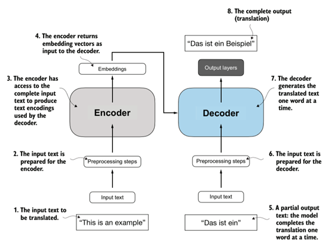
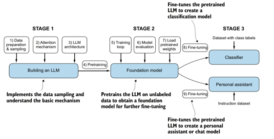

# 理解大语言模型

## 1. 什么是大语言模型？它有什么用？

**大语言模型**（Large Language Models, LLMs）以文本为输入，根据输入文本生成上下文关联的、看似合理的的输出文本。我们可以向它提问或者要求它写一篇文章，它会根据我们的输入生成看似合理的文本。

现在很多大模型还可以输入文字生成图片或者输入图片输出文本等，这类大模型是**多模态大语言模型**（Multimodal Large Language Model, MLLM）。我们这里只讨论GPT-like llms，并且默认训练数据是英语及类似的由天然分隔的单词组成句子的语言。

llms可用于文本分类、情感分析、内容补全等大量有关文本分析和生成的任务。比如说kimi k2模型，可以向它询问各种问题，让它做文本分析、机器翻译等任务，而不用额外的训练。llms为自然语言处理（Nature Language Process, NLP）提供了新的、更加强大的工具。传统的nlp，依赖于专家设计、挑选特征，不同任务使用的方法不尽相同，针对某项任务训练的模型通常不易甚至无法应用到另一项任务中。

## 2. GPT-like大语言模型的架构是什么样的？

llms通常基于**transformer**架构，它首次出自于论文《Attention is all you need》，最初是为了机器翻译而设计。它由encoder和decoder层组成，具体结构如图所示：

    
     transformer架构</sun>

 

>注：也有基于卷积或循环神经网络的llms，可以降低计算负担，但能否与基于transformer的llms相抗衡有待研究。

transformer在encoder阶段首先将输入句子的每个词语映射为向量（token），在decoder的末尾将预测得到的token映射回目标语言词语。transformer使用注意力机制捕捉token间的关系，通过掩码，我们让它无法看见全部训练数据，只能根据见到的tokens预测下一个token。每次将预测的token加入到已有的tokens，再次预测新的token。这个过程叫做**自回归**，会一直持续直到生成某个代表结束生成的特殊token。LLM在实际训练时为了并行化加速，处理方式与这里描述的不同，之后会解释其具体做法。

>Generative Pretrianed Transformer（GPT）只使用了decoder层，通过大量decoder层逐层堆叠构成。

## 3. 如何自己从头建造自己的语言模型？

如果要自己从头开始编写代码训练一个大语言模型（学习目的小规模llm），总共分为三个阶段。

### 第一个阶段

**数据预处理**：首先要收集文本数据，然后将文本分词并映射为tokens。在映射之前还可能进行文本过滤，筛除低质量甚至错误有害的"有毒"文本。

**编写代码**：实现注意力机制，构建完整的模型和训练流程。

在这个阶段能够很直观的感受大模型的"大"。

- **模型大**：llms通常由非常多层decoder层组成，包含数以亿计的参数。GPT3有96层 transformer层和175B（billion, 十亿）参数，大模型发展到现在，已经有不少万亿参数大模型了。

- **训练数据集大**：GPT3在 300 billion tokens上训练而成，而后面出现的更大规模的模型使用更大的数据集。

### 第二个阶段

**模型预训练**：在大量的tokens上采用自监督学习方式训练模型。假设有：`"@ if it is rainy, I will stay at home $"`（@和$这两个符号标志一段文本的开始和结束，只是我为表达方便而选取的，实际训练中使用两个特殊的token）。通过因果掩码，模型在预测每个位置时只能看到之前的句子，所有位置的预测通过并行计算同时进行。

在训练时，无论模型在上一个位置预测生成了什么结果，在预测当前位置时，都使用真实的前序tokens，这被称作**Teacher Forcing**技术。只有在推理阶段，才会将生成的token加入前序tokens序列，使用新的tokens序列生成下一个token，重复该过程直到生成结束。

**模型评估**：上述预测过程本质上是一个多分类任务，每次预测实际上输出一个和词表等长的概率向量，最大概率位置对应的词语为此次预测结果，因此可以使用交叉熵计算训练损失。每个位置的损失并行计算取平均，作为该训练样本的损失。

在预训练结束后，模型会自然而言的涌现出大量新的能力。虽然模型被训练为预测下一个词语，但它同样能够完成文本翻译、对话问答等大量与语言相关的任务。这主要是因为模型本身的复杂以及在大规模数据上训练后，模型捕捉到了语言中的各种细微之处，包括句法、时态等等，使得它能够根据用户的输入，通过next word prediction的方式生成看起来合理的输出文本。

### 第三个阶段：微调模型

经过预训练的模型已经有了对语言的深入理解，自身具备广泛的知识，可以完成大量语言相关的任务，因此也被称为**基座模型（Foundation Model）**。我们可以通过微调使模型在特定任务上表现更加优秀。

微调阶段采用监督学习方式。两种流行的微调是：

- **指令微调**：训练数据是"指令-答案"，比如要求翻译一段文本和正确的翻译结果
- **分类微调**：训练数据是被分类的文本，比如一封邮件文本和"垃圾邮件/正常邮件"标签