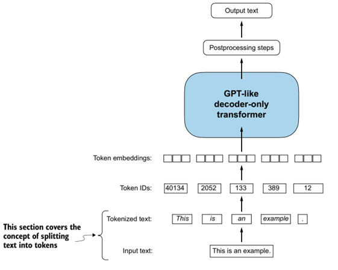
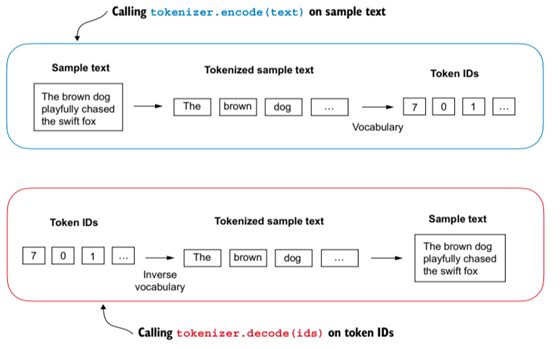
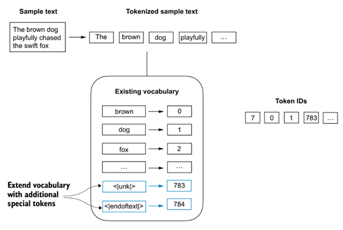
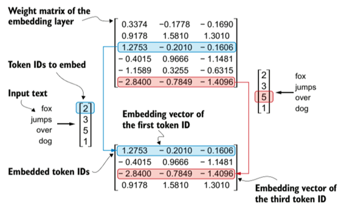
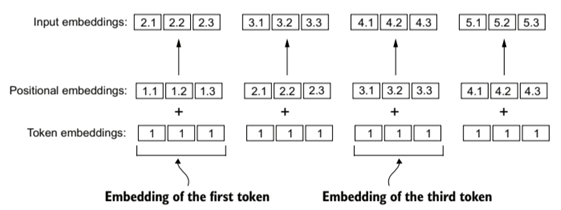
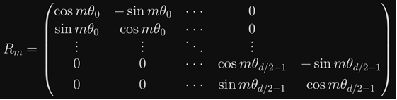
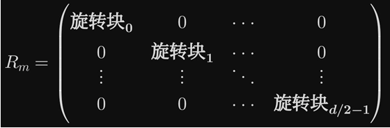
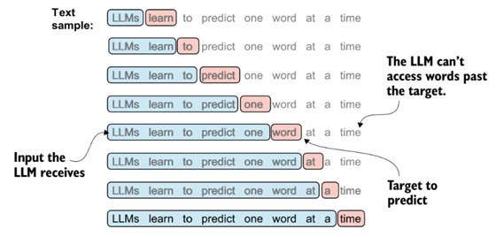

# 使用文本数据

## 概要

LLM是由Transformer层构成的深度网络模型，要想使用文本数据对它进行训练，必须先把文本处理为神经网络可以处理的数值型数据。总的来说，我们首先要把文本序列转换为对应的Token ID序列，然后把序列中每个ID转换为嵌入向量，最后把嵌入向量序列输入给LLM。


<div align="center">
    
    <br><sub>GPT-like decoder</sun>
</div>
<br>


接下来，我们会逐步解析这个过程。

> **注意**：在分析过程中，默认使用的文本是英语，模型架构为GPT3-like架构（当我提到GPT3的具体模型数据，指的是GPT3 175B）。此外，我会额外拓展一些处理其他语言或者更加现代的LLM技术的介绍。

## 一、如何把文本序列转换为Token ID 序列

### 1. 如何获得词表并转换为token ID序列

首先要获得词表，设法为每个词语分配一个ID，把每个词语对照词表替换为对应的Token ID。

考虑这样一个句子：`"If it is rainy tomorrow, I will stay at home; if it is sunny tomorrow, I will go out."`，如何获得词表呢？我们可以分词得到：

```
["If", "it", "is", "rainy", "tomorrow", "I", "will", "stay", "at", "home", ";", "if", "sunny", "go", "out", ",", "."]
```

（大小写通常区分，很多情况下，大小写有不同的含义，区分大小写可以帮助模型理解这些情况的不同），我们可以直接为它们依次分配整数，由此获得词表：

```
{"If":0, "it":1, "is":2, "rainy":3, "tomorrow":4, "I":5, "will":6, "stay":7, "at":8, "home":9, ";":10, "if":11, "sunny":12, "go":13, "out":14, ",":15, ".":16}
```

（可以依据某些规则为这些字符项排序后再依次分配ID）

我们可以对照替换，把原句子处理得到：

```
0 1 2 3 4 5 6 7 8 9 10 11 1 2 12 4 5 6 13 14 15 16
```

>注意：空白本身就是一种字符，在一些情况下，空白也是需要被处理和预测的，比如Python代码依赖缩进正常运行，这里我们只考虑简单的连续文本处理，不考虑空白。同样的，还有换行符、首行缩进符等字符，我们这里都不做考虑。

依照上面的办法，我们可以对更多的文本进行统计，由此获得一个更大更全面的词表，并将文本序列转换为Token ID序列。

我们可以用代码实现专门用于将文本序列转换为Token ID序列的类，它接受预先处理得到的词表，可以把文本转换为tokens，也可以把tokens翻译回文本。这样一个类初始化得到的对象被称为**tokenizer**。


<div align="center">
    
    <br><sub>encode_and_decode</sun>
</div>
<br>

### 2. 如何处理额外情况

即使我们在训练阶段统计了大量的文本，仍然可能在模型训练结束后处理新的文本时，遇到没有见过的词语，这超出了原有词表的表示能力，该怎么办？一个简单的办法是，给统计得到的词表增加`<|unk|>`，并为它分配ID，每当遇到没见过的词语时，都把它当做`<|unk|>`处理。

我们在上一篇文章介绍过，LLM是被训练来预测下一个单词，如果两段完整的文本之间没有任何关系，还强制要求模型去预测是否不合理？我们可以在互不相干的若干完整文本间插入`<|endoftext|>`，表示"前一段文本结束，下面的文本和之前的没关系"，避免模型学习到不存在的错误文本关联。

<div align="center">
    
    <br><sub>add_special_token</sun>
</div>
<br>

此外，还有如 **`[BOS]`** （beginning of sequence，序列的开始）、 **`[PAD]`** （padding，填充）等特殊token，它们各有作用，在实际训练中被广泛使用。

### 3. 更加现代的token ID获得方法

上面介绍的方法并不是现代LLM训练中采用的方法，它面临着许多问题，比如，把没见过的词语都当做`<|unk|>`处理，是否会影响模型训练效果？对于中文这类词语间没有天然间隔的语言，该如何获得词表？

GPT3并不使用上面的方法获得Token ID，它使用`Byte Pair Encoding(BPE)`方法。

假如有下面的语料（括号中的次数是该单词出现过的次数，后面的`</w>`是为了标记该单词的结束，因为接下来要提到的"合并"操作绝对不会跨词进行）:

```
"faster</w>" (10次)
"higher</w>" (8次)
"stronger</w>" (6次)
```

我们把它分割为初始字符状态:

```
f-a-s-t-e-r</w> (相邻对：fa, as, st, te, er</w>)
h-i-g-h-e-r</w> (相邻对：hi, ig, gh, he, er</w>)
s-t-r-o-n-g-e-r</w> (相邻对：st, tr, ro, on, ng, ge, er</w>)
```

统计各个相邻对总共出现的次数，会发现`er</w>`出现的次数最多（不仅要考虑一个相邻对在各个词中的出现次数，还要考虑各个词语本身的出现次数。如果有多个相邻对次数相等且最多，依照某种方式选择一个，比如按照字典顺序，总之不能随机挑选，必须确保对同样的文本最终得到相同的结果），于是我们把`er</w>`合并，得到:

```
f-a-s-t-er</w> (相邻对变为：fa, as, st, ter</w>)
h-i-g-h-er</w> (相邻对变为：hi, ig, gh, her</w>)
s-t-r-o-n-g-er</w> (相邻对变为：st, tr, ro, on, ng, ger</w>)
```

同样的，我们此时再统计新的相邻对的出现次数，选择出现次数最多的相邻对进行合并，由此得到新的组合。

上面的合并什么时候停止？Token ID如何得到呢？在第一次分割为字符时，我们会为每个字符分配一个整数ID（这是一种实现方式，任何保证各字符有唯一ID的分配方法都可以），如:

`"f":0, "a":1......`

在经过第一次合并后，我们新得到一个`er<w>`，我们会为"er"（`<w>`只是词边界标记）分配一个ID（接着已有的ID依次分配，不是e的Token ID与r的Token ID合并得到）。

在第二次合并后，我们又会得到一个新的组合，我们为它分配Token ID。

重复上述过程，每一次都会得到一个新的组合并分配Token ID，自然而然地会出现二字符组合、三字符组合、四字符组合......这个过程由文本本身的情况决定，不受人为干预。通过设定合并轮数来控制词表的大小——每多合并一轮，词表大小加一。

假如遇到此前没有见到过的新单词：`hjakeder`（我也不知道这是什么，随便打的）

假设BPE学习到组合：
```
hjake:165
der:9688
```

并且没有学习到hjaked或hjakede，否则会优先选择最长的那个，而不是hjake，因为采用贪心匹配，每次匹配尽可能长的组合。

那么`hjakeder`的Token ID就是 `165 9688`

于是这个单词在最终转化为嵌入向量时（下面很快会讲到什么是嵌入向量），对应两个向量。这看起来有些奇怪，一个单词对应两个（有些词语可能对应更多）嵌入向量，但实际上通过BPE得到的词表，不一定是完整的单词。比如说单词unhappy，可能学习到的是un和happy这两个组合，并没有学习到unhappy本身，那么unhappy的Token ID由un和happy的ID组合而成，同样也就对应两个嵌入向量，它们会被依次送入模型，模型会通过注意力机制学习这种组合的关系。得益于这种组合技术，模型可以处理近乎所有单词。

上面的讨论没有涉及BPE技术的全部内容，它没能解释如何处理中文这类语言。如果要处理中文，我们似乎依旧要设法把中文通过某种办法进行分词（确实存在这种技术，但并不是LLM训练中的首选）。实际上，GPT3选择把一整个中文句子当做一个词语（这样一个汉字就等效于一个英文字母），让BPE自己去学习合适的组合。比如"人工智能很强大，我经常使用它。"会被分为：

```
["人工智能很强大"， "我经常使用它", "，", "。"]
```

通过学习，可以自动的学习出如"人工智能"、"经常"等组合，但是也可能学习到"工智能很"这种无意义的组合。学习到的组合由文字和词语的出现的频率决定，一般在大规模语料上学习到"工智能很"这种无意义的组合可能性很低。

读者可能注意到BPE中的B是byte（比特），但我们上面的讨论并不涉及比特。实际上，更加现代和先进的做法是把文本转化为unicode字节编码表示，比如：

```
字符： "人"
UTF-8编码：\xe4 \xba \xba (3个字节)

字符： "工"
UTF-8编码：\xe5 \xb7 \xa5 (3个字节)

句子："人工"
字节序列：[\xe4, \xba, \xba, \xe5, \xb7, \xa5]
```

BPE合并：
- 可能合并 `\xba+\xba` → 一个token
- 可能合并 `\xe4+\xba+\xba` → 代表"人"的token
- 可能合并"人"token + "工"的前缀字节 → 代表"人工"的token

由于Unicode编码可以表示任意的字符，我们的tokenizer因此可以处理任意种类语言。

传统的BPE在处理中文时效果并不十分出色，但**byte-level BPE**对中文处理效果优秀。后者把汉字分解为字符处理，即使是生僻字也能够处理，同时实现了语言无关处理，并且直接处理字节，相比起处理单个汉字，是一种更加精细化的操作。


## 二、从token ID序列转换为嵌入向量

### 1. token ID序列转换为向量序列

虽然Token ID序列也是数值型数据，但直接把它输入模型是不合适的。ID是整数，本身区分大小，然而实际上这个大小关系是无意义甚至是误导性的。假设BPE学习到：

```
"un":258
"happy":6868
"ness":264
```

happy的ID远比un的ID大，un的ID与ness的ID大小接近，但这样的大小关系并没有任何实际含义，既不能说明un和happy差异巨大也不能说明un和ness十分类似，反而会误导模型。

在传统的分类任务中，**one-hot编码**是将非类别型数据转化为数值型数据的常见做法。假如有类别"红""绿""蓝""黄"，我们可以轻易的为它们分配：

```
"红"：0，"绿"：1，"蓝"：2，"黄"：3
```

然而正如我们在上面说过的，`0 < 1`并不能实际代表"红"与"绿"之间任何实际关系，反而引入某种偏见误导模型。一种公允的做法（one-hot）是：

```
"红"：[1, 0, 0, 0]
"绿"：[0, 1, 0, 0]
......
```

这种方式可解释性好，不同位置处为1代表不同的类别，并且这种位置的不同可以帮助模型直观的区分不同类别，而不会引入额外的偏见。

看起来这是一种很不错的方法，所以我们会通过这种办法把Token ID转化为嵌入向量吗？**并不会**。

最直观的原因是one-hot编码只有一个位置为1，其他位置都为0，信息表示效率不高。如果我们的词表大小为50257（这正是GPT3的词表大小），那么我们表示一个Token ID需要一个形状为`(50257,)`的向量，并且这个向量除了一个位置外全为0。这显然是一种十分低效的表示，为计算和存储带来巨大负担。

此外，使用one-hot编码，既不能表示每个类别之间的相互关系，也不能编码该类别本身的信息，这对于上述的四种颜色或许没什么影响，但在文本处理中，每个组合（指BPE中每轮合并得到的组合）自身就具有含义，组合之间也可能有着某种关联，这是one-hot编码完全忽视的。

如果我们让一个one-hot编码向量的所有位置都用于信息编码，这样我们就可以在减少向量维度的情况下，编码更多信息。

我们可以初始化一个形状为 `(vocab_size, embed_dim)` 的嵌入矩阵，对于Token ID 19，我们直接取这个矩阵的第19个行向量，这样就实现了Token ID向嵌入向量的转换。这个矩阵初始值随机给出，在随后的模型训练中会不断更新参数。我们可以认为：**训练良好的embedding向量在向量空间中呈现出语义结构，使得语义相近的token在空间中距离更近**。（GPT3的嵌入维度是12288，远小于词表长度50257）


<div align="center">
    
    <br><sub>token_to_embedding</sun>
</div>
<br>

于是，将Token ID序列转换为向量序列就成了一个**查表过程**，按照Token ID的值到嵌入矩阵的对应位置取向量就可以了。

### 2. 位置嵌入

**注意力机制**（模型学习理解句子含义的核心机制，下一篇文章会详细介绍）对token位置是置换等变的，不论输入"If it is rainy"还是"if rainy it is"亦或"rainy it if is"，输出的结果都相同，这显然对于理解顺序十分重要的人类语言来说，是个不足之处。为了弥补这个不足，我们可以手动为数据注入位置信息。虽然注意力机制本身依旧不关注顺序，但注入位置信息后"If it is rainy"和"if rainy it is"会变成两个完全不同的输入。比如说，假如if本身的嵌入向量是`(2.4634,1.5678, 3.4967)`，它在不同的位置会被注入不同的信息，也就是和不同的位置向量相加，这样它本身的嵌入向量会发生变化。同理，一旦改变顺序，每个单词的嵌入向量都可能会和不同的位置向量相加，整个向量序列都会发生改变。

<div align="center">
    
    <br><sub>position_embedding</sun>
</div>
<br>


即使token嵌入向量一样，处在不同位置，注入位置信息后得到的向量也不相同。

位置编码有两种：**绝对编码**和**相对编码**。

#### 绝对位置编码

绝对编码分为固定编码和可学习编码。

首先要说明的是，在LLM训练中，一个样本的长度是固定的。无论一篇文本的Token ID序列有多长，它都会被划分为固定长度的样本。比如说：

```
0 1 2 3 13 5 6 7 8 9 15 0 1 2 11 14 5 6 12 13 16
```

令`max_length=8`，那么它会被划分为：

```
0 1 2 3 13 5 6 7
8 9 15 0 1 2 11 14
5 6 12 13 16(这里剩余的不足八个，在实际训练中，它后面可能接其他文本，可能用无意义的ID填够8个，也可能直接丢弃，这里不做考虑)
```

**固定编码**通过某种固定方式（比如一个函数）为第1到第`max_length`个位置每个位置分配一个位置向量，这些位置向量的值不会在训练过程中更新。

**可学习绝对编码**和之前说的嵌入向量做法十分相似，随机初始化一个形状为 `(max_length, embed_dim)` 的位置嵌入矩阵，每个位置取相应的位置嵌入向量，再和该位置的文本嵌入向量相加即可。"可学习"表示这个嵌入矩阵的值在训练过程中会不断更新。

绝对位置编码标识token在整个token序列中的绝对位置，相对位置编码则区分token间的相对位置。

#### 相对位置编码：RoPE

很多现代大模型采用一种名为 **RoPE(Rotary Position Embedding)** 的相对编码技术。这是一种卓越的相对编码技术，通过绝对编码捕捉相对位置。

我们知道注意力机制通过query与key计算得到注意力，然后以注意力为权重加权value得到计算结果。又知道点积注意力是一种常用注意力计算方式，如果我们能够找到一个函数f，实现基于位置m对q进行某种变换、基于位置n对k进行某种变换后，内积结果等于考虑相对位置m-n后计算得到的注意力。

追一科技研究团队找到了这样一个f——**旋转函数**。接下来我们详细介绍这个算法。

让我们先看看二维时的情况。

我们知道，可以通过复数运算实现旋转，把向量视为复数可得：

$$
q = q_0 + iq_1  \\  k = k_0 + ik_1
$$

于是，f的旋转操作可以这样进行：

$$
f(q,m) = q*e^{imθ} = (q_0 + iq_1)(\cos m\theta + i\sin m\theta)
$$

展开后以矩阵形式表示：

$$
\begin{pmatrix}
q_0' \\ q_1'
\end{pmatrix}
= \begin{pmatrix}
\cos m\theta & -\sin m\theta \\
\sin m\theta & \cos m\theta
\end{pmatrix}
\begin{pmatrix}
q_0 \\
q_1
\end{pmatrix}
$$

此时的内积满足：

$$
f(q, m) \cdot f(k, n) = Re[q \cdot k^* \cdot e^{i(m-n) \theta}]
$$

>**说明**：复数向量计算内积时，需要对第二项取共轭，这样可以保证计算结果是实数。

可以看到，此时的内积完美的满足了我们的要求：
- `m-n=0`时，q和k处于同一位置，退化为普通的点积注意力
- `m-n`不变时，不同的m、n计算出的结果相同，这符合了相对编码只关注相对位置的特点

接下来要处理的问题是θ的值是多少？如何推广到高维？

假如我们的嵌入维度为d（通常为偶数），每两个维度视为一个复平面，那么一共可划分为d/2个子空间，对于第i个子空间，它的旋转频率我们设置如下：

$$
\theta_i = 10000^{-2i/d}
$$

这里的10000是一个预先设置的超参数，用于控制频率衰减的速度，可以根据实际情况调整。

由于每个子空间的旋转彼此独立，我们可以得到下面的旋转矩阵：



更形象一点：



在实际训练中，我们并不直接使用这个旋转矩阵进行计算，那样效率太低。

我们首先根据公式计算出每一个θ的cos和sin，把向量x分为前半部分x1和后半部分x2，把计算得到的cos和sin按照索引i组织为`fre_cos`（下面简写为cos）和`fre_sin`（同样使用简写），则旋转计算公式为：

```
x_rot = [x1*cos - x2*sin, x2*cos + x1*sin]
```

这里的技巧在于，把x的前一半维度数值当做实数坐标，后一半维度数值当做虚数坐标，以此来模拟复数向量运算，而不是真的进行复数向量运算。并且利用了旋转矩阵R的稀疏性，把矩阵运算简化为逐元素运算。

这里的θ计算公式其实设计得十分巧妙。θ的值随指数衰减，根据负指数函数的特性，负指数函数的导数随自变量增大而减小，随着i增大，θ减小得越来越慢，频率衰减速度不断降低，决定高频维度相对更多（"高"指接近1的频率，"低"指接近0的频率）。

在|m-n|固定时，高频维度组成的子空间旋转角度更大，这表明高频维度对距离更加敏感，保留了更多位置信息，模型会被迫把它们优化为捕捉局部精细模式；低频维度对距离敏感度更低，它们会被优化为捕捉长距离全局模式。高频维度相对更多，使得模型更加擅长捕捉局部模式，这正符合自然语言中"短距离依赖更密集"的特点。

## 三、针对深度网络模型组织训练数据

我们在上一篇文章说过，LLM在预训练阶段采用自监督学习，使用**Next Word Prediction**训练方式。


<div align="center">
    
    <br><sub>next_prediction</sun>
</div>
<br>

考虑有Token ID序列：

```
0 1 2 3 13 5 6 7 8 9 15 0 1 2 11 14 5 6 12 13 16
```

令`max_length=8`，有：

```
0 1 2 3 13 5 6 7
8 9 15 0 1 2 11 14
5 6 12 13 16（不足8个，为方便讨论，暂时忽略）
```

那么输入x为：

```
0 1 2 3 13 5 6 7
8 9 15 0 1 2 11 14
```

输出y应为：

```
1 2 3 13 5 6 7 8
9 15 0 1 2 11 14 5
```

y由x后移一位得到。数据本身提供标签（y），这正是自监督学习的标志。

对于实际训练中更大规模的文本数据，我们在实现从词到token到embedding的转换后，会按照预先设定的`max_length`，将向量序列划分为不同的样本，并且设定每次训练批次。每个批次的训练数据的形状为：

```
(batch_size, max_length, embed_dim)
```

此外，值得指出的一点是，在上面的数据划分例子中，我们默认`stride=max_length`，这样划分的每个x没有重叠，但实际训练中可以令`stride < max_length`，让每个x和前后的x有部分重叠。这样可以保持上下文连贯，还能提高数据利用率，实现数据增强，提高模型泛化能力。

在具体的训练过程中，**掩码操作**是必要的，它能让模型忽略pad token并保证模型看不到未来的token。在后面的文章中我们会详细讲解这一点。