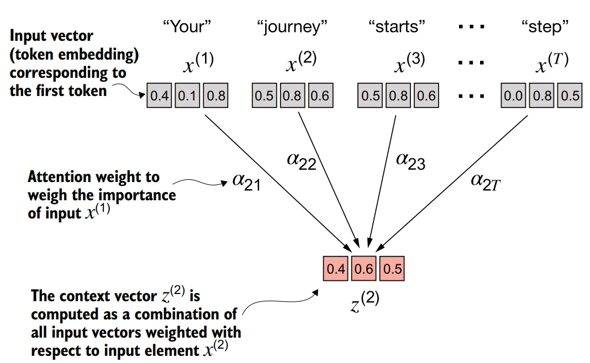
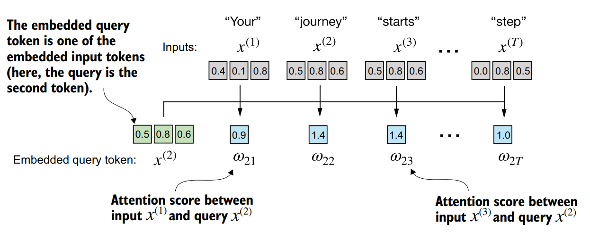
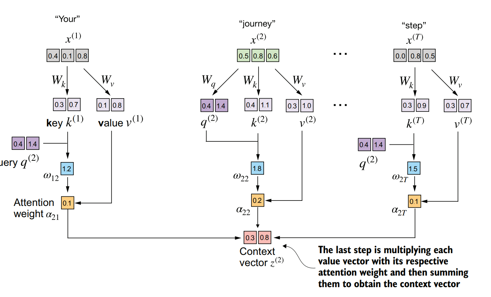
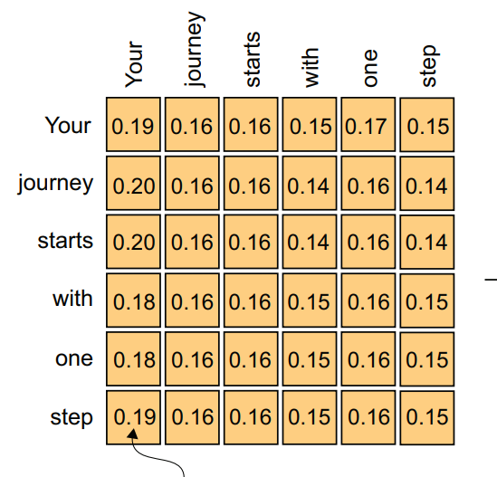
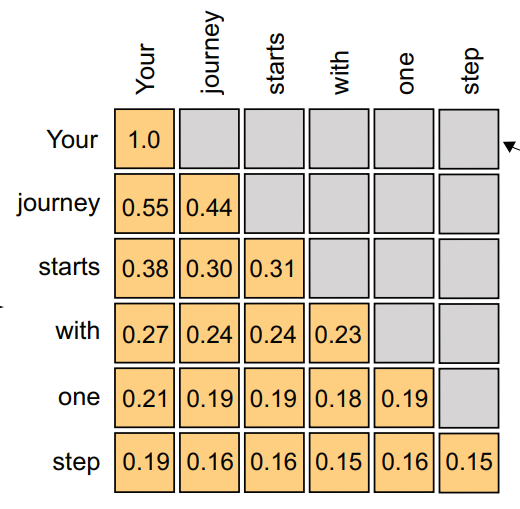
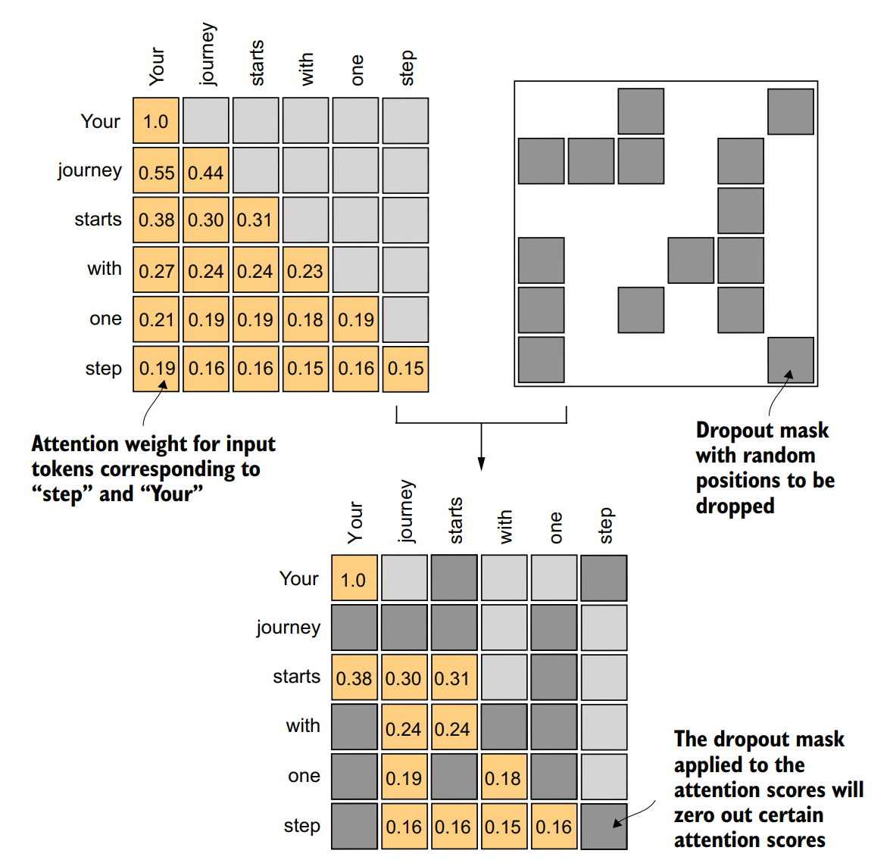
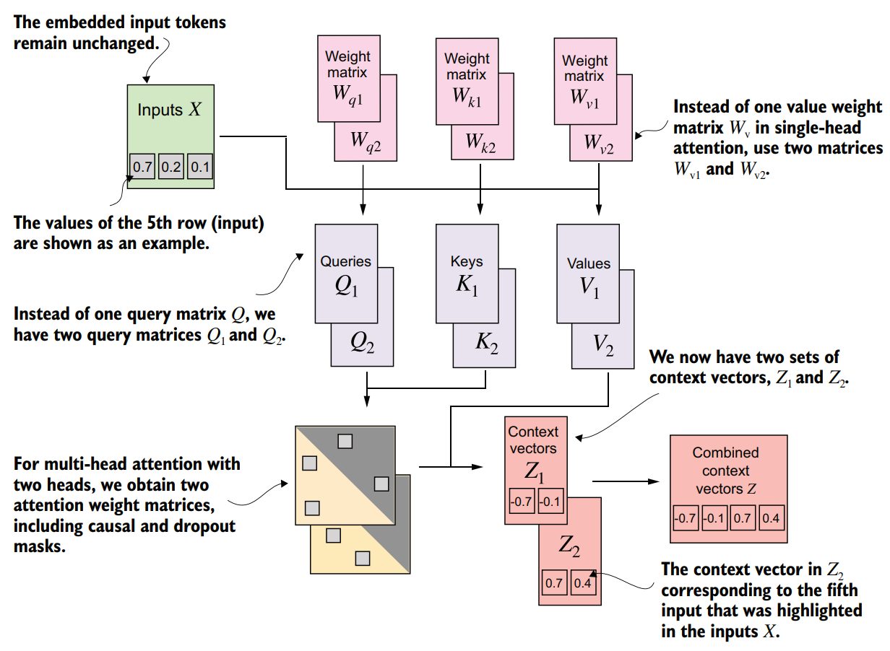

# 编码注意力机制

## 概要

这次我们会详细介绍**注意力机制**——LLM理解文本的核心模块，具体而言，我们会介绍：

- 自注意力（Self-Attention）
- 因果注意力（Causal Attention）
- 多头注意力（Multi-Head Attention）

## 一、自注意力

对于句子中的每个token，模型通过注意力机制（softmax 权重）把其余token的Value向量（对token的嵌入向量进行线性变换得到）做加权求和，得到该 token 在这一层的上下文表示。

    
     weight_sum</sun>

 

如图所示，对于第二个输入"journey"，我们计算它与各个输入向量的权重，加权和捕捉了“journey”与其他token embedding的某种关系。与“journey”关联越大的token，对应的权重 **α** 越大，该token对最终的加权和 **z** 贡献越大。

    
     weights</sun>

 

对于一个一般的注意力机制，输入`query、key和value`，我们使用query和key计算出weights，与value进行加权求和得到输出。`点积注意力`是一种常用的注意力计算方式，使用点积注意力得到输出的具体公式如下：
$$
W = softmax(\frac {Q \cdot {K ^\mathrm {T}}}{\sqrt {d_k}}) \\
Attention(Q,K,V) = W \cdot V
$$
式中分母项的d_k是K每一项的嵌入维度，除以这个分母项，一方面可以避免注意力分数数值太大导致梯度消失，另一方面可以将点积的方差标准化为1，使得输出值保持在合理范围内。

**自注意力**顾名思义是"自己和自己的注意力",这意味着Q,K和V是由同一个X进行不同的线性变换得到，并且：
$$
Q,K,V \in R^{m*d}
$$

对输入的Q,K和V先分别进行线性变换，再执行注意力操作，这样可以增强模型的表达能力（详细解释见文末）。同样的，对于加权和Z，在最终输出前，我们也可以再进行一次线性变换。

    
     full_weights</sun>

 

具体而言：
$$
Q = X \cdot W_q \\
K = X \cdot W_k \\
V = X \cdot W_v \\
Z = Attention(Q,K,V) \\
O = Z \cdot W_o
$$

通常来说，注意力机制不改变特征维度，即：
$$
d_x = d_q = d_k = d_v = d_z = d_o
$$
上图中X的输入维度是3，但后续Q，K，V和Z的维度是2，这主要是为了更清晰的演示。

## 二、因果注意力

按照（一）中的自注意力计算方法，我们很容易得到下图的注意力权重矩阵：

我们一开始说过，模型在训练时，采用**next-prediction**的自监督学习。这意味着，模型在看到“Your”时，需要去预测“journey”；当模型看到“Your journey”时，需要去预测“starts”。如果直接使用这样一个注意力权重矩阵，对于第一行而言，它的输出包含后面5个token embedding的贡献，而它的目标是预测“journey”——这意味着**模型在预测未来前已经看到了未来**！为了避免这种荒谬的情况发生，我们需要借助**掩码**，得到这样的注意力权重矩阵：

    
     m_w</sun>

 

以“with”为例，它需要预测“one”，而它的输出由“Your”、“journey”、“stats”和“with”贡献而成，不包含后面的“one”和“step”，因为它们的权重被掩码为0。

掩码注意力权重矩阵的数值和全注意力矩阵不同，是因为在掩码操作后，对每行的非0部分再次进行了softmax操作，确保每行和为1。

相比起计算出**全注意力权重矩阵**后再进行掩码操作和softmax操作，更加高效的方式是直接对一开始计算出的**注意力分数矩阵**（对它执行sofamax操作后得到注意力权重矩阵）进行掩码，这样不必进行额外的softmax操作。直接将需要被掩码的位置设置为-inf或者一个绝对值很大的负数，这样在softmax操作后，这些位置值为0。

>补充：在深度学习中可以使用dropout机制，使得模型隐藏层的某些单元（随机挑选得到）被忽略（这里表现为被选中位置的注意力权重为0），这样可以避免模型过于依赖某些隐藏层，起到抑制过拟合的作用。下图是被“dropout”后的注意力权重矩阵，可以看到某些权重被设置为0，这些位置的token embedding对最终的输出没有贡献。

    
     dropout</sun>

 

## 三、多头注意力

在上面的实现中，我们只计算了一份注意力权重，可以看做**单头注意力**。我们可以把嵌入维度d分为若干部分，每一部分单独执行注意力操作，最后把各部分输出在嵌入维度**拼接**起来。

    
     multi-head</sun>

 

对于每个头，它拥有独立的权重矩阵用于计算Q、K、V和Z，这把单头的一个高维空间分为多个互不干扰的低维子空间，模型不同的头能够进行不同的信息聚合，比如最终可能某些头长期关注相邻词，某些头聚焦相同句法主语，某些头在机器翻译里自动对齐源语-目标语。

多头注意力的实现十分方便，仅仅只需要在之前的自注意力的实现上做一个小小的改动。
对于自注意力的下列计算：
$$
Q = X \cdot W_q \\
K = X \cdot W_k \\
V = X \cdot W_v \\
Z = Attention(Q,K,V) \\
O = Z \cdot W_o
$$
我们在多头注意力中计算Q,K和V时，同样各自使用一个大的权重矩阵一次性完成计算，不用每个头依次计算（依次计算不能利用GPU强大的并行计算能力）。在Attention阶段，在具体的pytorch实现里，Q是形状为（batch_size, seq_len, dim）的张量，我们把它reshape为（batch_size, num_heads, seq_len, head_dim），其中head_dim = dim / num_head，接下来的注意力计算和之前一模一样。这样计算得到的Z，shape是（batch_size, num_heads, seq_len, head_dim），我们把它reshape为形状为（batch_size, seq_len, dim）的张量。

>补充：多头注意力同样通常保持输入和输出的特征维度相同，因此实际进行的每次矩阵运算的一个矩阵维度从dim降为head_dim，每次矩阵运算的时间减小，得益于GPU的并行计算能力，每个头并行计算，整体的计算时间也会降低。

我在文章开始部分提到：“对输入的Q,K和V先分别进行线性变换，再执行注意力操作，这样可以增强模型的表达能力”，为什么线性变换可以增强模型的表达能力？

如果不使用线性变换，注意力机制只能计算输入向量的原始相似度。线性变换提供了可学习的投影矩阵，让模型能够：
- 自主决定哪些特征维度重要
- 将原始特征重新组合成语义更丰富的隐藏特征
- 为不同注意力头分配不同的子空间

线性变换的本质价值在于：它提供了**可优化的、任务特定的坐标系**。在注意力机制中，它将原始输入向量从"**数据空间**"映射到多个"**语义决策空间**"，使后续的相似度计算（本质仍是线性操作）能够表达高度非线性的关系。没有这一步，注意力退化为固定的核函数；有了它，模型获得了分配注意力焦点的自由——这正是表达能力提升的核心。

