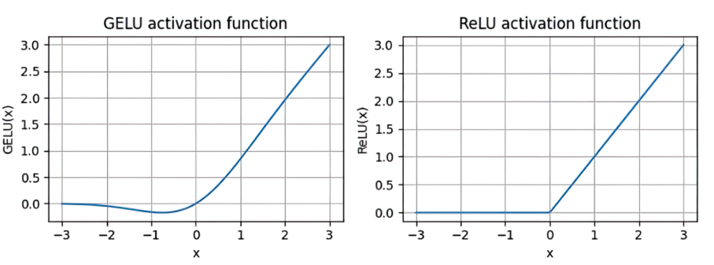
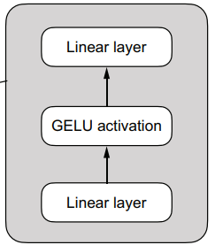

# 实现一个GPT模型

## 概要

GPT2模型的架构如下图所示：

    
     GPT</sun>

 

下面的篇幅，我会介绍几个重要模块的实现和作用，包括：

- LayerNorm（层归一化）
- activation function（激活函数）
- shortcut connection（残差连接）
- Feed forward（前馈网络）

## 一、Layer Normalization

在训练深度网络时，有时会遇到**梯度消失/爆炸**问题。我们知道梯度下降法通过梯度调整模型的参数，如果梯度太小或太大，参数不能合理调整，导致收敛困难或者训练效果差等问题。

### **WHY**

**Layer Normalization**可以加速收敛，并提升训练的稳定性。最基本的Layernorm能够将确保每个样本的特征数据满足均值为0，方差为1。还可以添加可学习的参数scale和shift，使得处理后的数据满足均值为shift，方差scale，这使模型能够够好的适应它处理的数据。

每次参数更新后，对于同一个样本的输出结果不同。假如层1原本对于样本的输出范围是[-1,1]，层2学习到了怎么处理这个范围的输入。在一次更新后，层1的输出范围变成[-10,10]，层2此时需要学习如何处理这个范围的输入。这种情况下，每一层的重点不仅仅在专注于特征本身，还需要学习处理不同范围的数据。通过layernorm可以避免这个问题。

此外,过大的输出可能导致梯度爆炸，或者处在激活函数的饱和区导致梯度消失。

不同的shift和scale可以控制不同的分布，工作在激活函数不同的区域。比如：

GELU(x) ≈ x * Φ(x)

不同区域特性:  
x ∈ [-2, 2]: 近似线性, 信息保留完整  
x > 2 或 x < -2: 饱和区, 信息压缩

不同层可能需要:
- 信息保留型层: 工作在接近线性区 (scale 较小)
- 特征选择型层: 利用非线性特性 (scale 较大)

### **HOW**

**LayerNorm**对单个样本进行归一化。

考虑一个样本： 
$$ 
x = [x_1, x_2, x_3,...,x_n]\\

x = \frac{x - mean} {var + eps}  
$$

这里的均值和方差是一个样本的所有特征计算得到的。

## activation function

**RELU**函数提供非线性，计算简单。

**GELU**函数比**RELU**更加复杂，但具备以下优势：  
- 处处可导，梯度连续，优化更稳定
- 平滑衰减，保留负值部分信息（不是直接置零）
- 可看作"以概率门控"：输入越大，保留概率越高

> 为什么可以看做概率门控？

>GELU(x) ≈ x * Φ(x)  
Φ(x)是标准正态分布 N(0,1) 的累积分布函数（CDF），这表明x以Φ(x)的概率被保留。

    
     activation function</sun>

 

## shortcut connection

对于非残差：x -> y = F(x) -> L
梯度为：
$$
\frac {∂L}{∂y} *\frac {∂y}{∂x}
$$

对于残差连接：x -> y = F(x) + x -> L  
梯度为：
$$
\frac {∂L}{∂y} * (\frac{∂F}{∂x} + 1)
$$ 

+1 项确保了L对y的梯度一定可以回传，即使在F对x的梯度很小的情况下。这保证了深层网络中梯度至少有一个稳定的流通渠道，缓解了梯度消失问题。

## Feed Forward

前馈网络结构：

    
     feedforward</sun>

 

在**Transformer**中，输入先经过注意力处理，然后被前馈网络处理。

**Attention**是全局操作，计算所有位置对之间的注意力权重，让每个 token 与其他所有 token 交互，捕捉关系。

**Feed Forward**对每个 token 单独做非线性变换，增强每个 token 的表达能力。

>第一个linear会把每个token投影到更高维空间（x4），允许模型学习更丰富、更分散的特征表示，然后做非线性变换。之后会筛选和组合最有用的特征，去除噪声，并回到之前的嵌入维度，确保可扩展性。