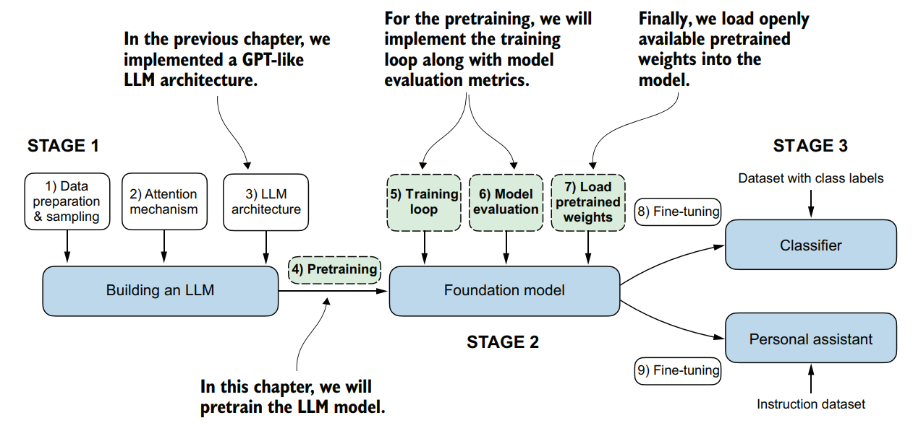
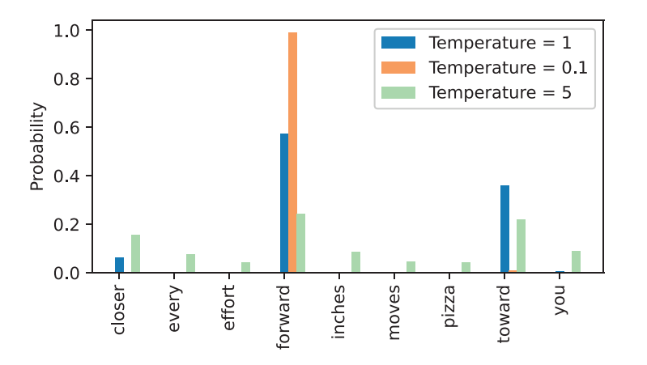

# 在无标签数据上预训练

## 概述

整个过程如图所示：

    
     the_whole_process</sun>

 

我将介绍其中使用的一些技术，包括：

- Cross-Entropy Loss(交叉熵损失)
- Temperature Scaling
- Topk Sampling

## Cross-Entropy Loss

为了训练模型，我们需要一个损失函数来评估训练效果，并据此更新参数。我们这里使用**自监督**方式训练模型。

对于一个token序列X，我们把它向后偏移一位作为targets。也就说是，对于x[0,...,k],它的target是x[k+1]。这是一个**多分类问题**。

输入x[1,...,k]，模型输出一个logits张量，我们取序列维度上的最后一个logit向量——它是对x[k+1]的预测向量。它的长度和词表长度相同，其中最大值的位置 在词表中对应的token，就是预测结果。在计算loss时，我们通常使用softmax将logit向量转化为归一化的概率向量。我们的目标显然是让正确位置的概率最大化。

下面是交叉熵损失计算公式，训练的目标是最小化损失。

$$
L = -\frac{1}{N} \sum_{i=1}^{N} \sum_{c=1}^{C} y_{i,c} \log(\hat{y}_{i,c})
$$

y_i_c只在正确位置为1，其余皆为0。

## Temperature Scaling

如果调用过大模型的api，会知道有一个temperature参数。

在llm进行推理时，模型从输出的logit向量中选择最大值位置对应的token。为了增加模型的随机性和创造性，我们可以让这个选择过程变为根据概率进行选择。这样logit向量的最大值的位置，依旧最有可能被选择，但其他位置也有被选中的可能性。

让我们使用temperature对logit进行处理:

$$
scaledlogit = \frac{logit}{temperature} 
$$

    
     temperature</sun>

 

如图所示，大于1的temperature会使得各个token被选中的概率更均衡，小于1的temperature会使得原本最容易选中的token更容易被选中。

>softmax的底层是e^x。e^x的导数是它本身。当x除以大于1的temperature时，所有的x都减小，但是大的x的e^x减小的更多；当x除以小于1的temperature时，所有x增大，但是最大的x对应的e^x增加最多。

## Topk Sampling

我们之前提到大于1的temperature可以让各个token被选中的概率更均衡，但是大部分token原本被选中的概率小，是因为选择它们和当前上下文不匹配or会导致语法错误or没有意义。

**Topk采样**会选择概率最大的k个token，然后在它们中进行选择，这可以缓解单独增大temperature可能带来的问题。
