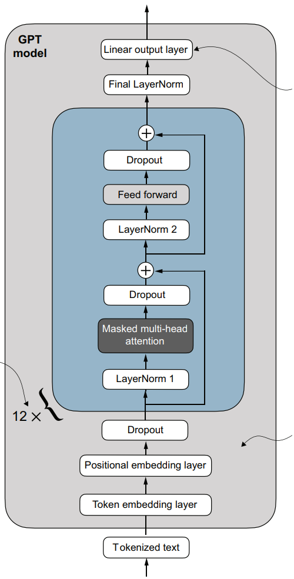
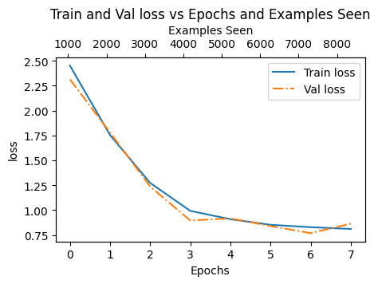
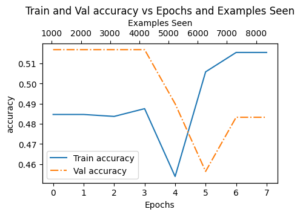
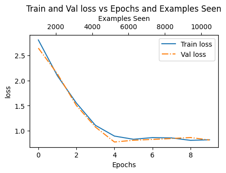
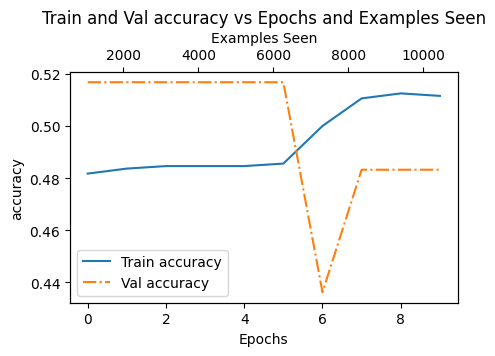
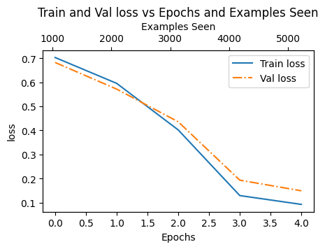
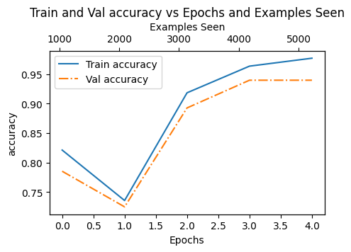

# 分类微调

## Introduction

经过预训练的LLM已经有了对语言的理解，它们能够理解输入的文本，并生成连贯和有意义的回复。我们可以利用LLM对文本进行分析，完成特定的语言任务，比如说识别一封邮件是否是“spam”或者判断一段文本的主题是什么。但只经过预训练的LLM通常不会生成恰好符合我们要求的回复，比如说给它一封邮件，它不一定会判断是否是垃圾邮件，它可能会写回复或者进行介绍内容等。为了将LLM自身的语言分析能力应用到特定的分类任务，我们需要预训练后的LLM进行**Classification Fine-tunig(分类微调)**。

## Method

LLM的最后一层是一个线性层，它会把输入的特征向量映射成 和词表等长的logit向量。我们可以把它替换为 输出为K维（K类）的线性分类器，然后使用为分类微调准备的数据训练这个分类器。

### 数据处理

分类微调的数据由**文本-标签对**组成。为了进行批次训练，我们需要把文本处理为相同长度。可以选择最长文本的长度作为最大长度（不能超过模型的上下文长度），把长度不足的文本使用特殊符号（如'<|endoftext|>'）填充；也可以手动设定一个合理的最大长度，不足的填充，超过的裁剪。这里使用第一种方法，使用SMSSpamCollection数据集。

标签是文本的类别。在计算loss时，我们取logits向量在序列维度上的最后一个logit向量作为预测，因为在预测它时 模型见过整个文本。

### 进行微调

在微调时，我们一般不用更新整个模型的权重，只需要更新部分权重来适应新任务。

  

我尝试了微调：
- 1."output layer"
- 2."output layer+layerNorm"
- 3."output layer+layerNorm+blocks[-1]"  

部分实验结果如下图：

  <table>
    <tr>
      <td width="50%">
        
         1-Loss 曲线
      </td>
      <td width="50%">
        
         1-Accuracy 曲线
      </td>
    </tr>
  </table>

  <table>
     <tr>
       <td width=50%>
         
          2-Loss 曲线
       </td>
       <td width="50%">
         
          2-Accuracy 曲线
       </td>
     </tr>
  </table>

  <table>
     <tr>
       <td width=50%>
         
          3-Loss 曲线
       </td>
       <td width="50%">
         
          3-Accuracy 曲线
       </td>
     </tr>
  </table>

 

方式1只对分类头进行训练，方式2把layernorm加入微调。这两种微调方式都没有改变gpt2理解文本的核心部分——**transformer blocks**，这导致模型的主干部分没有学会专注于识别输入文本是否是垃圾邮件，仍然是专注于预测之后的文本。把最后一个transformer block加入微调，训练效果**显著更优**——验证集准确率接近**95%**，并且只用了**4轮**训练就达到了这个效果。对最后一个transformer block进行微调，不仅保留了前11个block原本具备的对文本进行理解的能力，还通过调整最后一个block使处理后的特征更加符合分类任务。

**核心结论**：最后一层 Transformer 负责将通用语义映射到任务特定空间，
冻结它会导致分类头与预训练特征空间不匹配。

