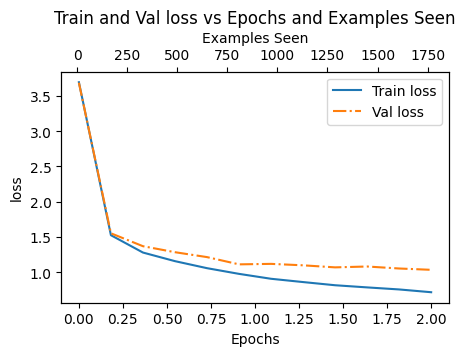
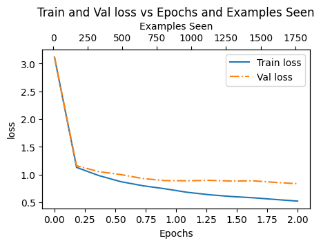
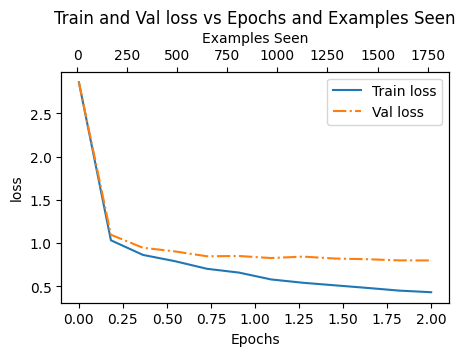

# 指令微调

## Introduction

微调主要分为**分类微调**和**指令微调**两种。输入一个指令，比如要求LLM翻译文本或者总结主要内容等，LLM不一定会输出符合指令要求的回复。通过**指令微调**，LLM可以学会遵循指令要求。

## Method

### 数据处理

指令微调实际上采用的是自监督学习。指令-响应对构成了一个样本，我们只需要把每个样本“右移一位”作为targets——这正是我们在预训练时做的事情，不过这里有两个细节和 预训练以及分类微调 不同。

- **每个批次数据最大长度不同**。不同于预训练和分类微调时 有一个全局最大长度，每个批次都裁剪或者填充到固定长度，**指令微调**中每个批次根据该批次文本的长度自主选定一个最大长度。相比**分类微调**的做法，这里的动态最大长度其实更好，不过分类微调通常数据量更小，花费时间更少，因此简单的全批次固定长度也可以接受。

- **targets无效化掩码**。由于不同的指令-响应对长度存在差异，targets右端通常由"<|endoftext|>"填充。如果这些填充位置都被纳入loss计算，模型被迫分心去学习预测这些"<|endoftext|>"，但实际上我们只需要模型学会在响应末尾预测一个"<|endoftext|>"。因此，我们通常只保留一个"<|endoftext|>"，其余的用 -100 填充。nn.CrossEntropyLoss()有一个参数是**ignore_index**，它的默认值是 -100。这意味着，值为-100的位置处不会纳入loss计算。

 

> 除了对多余的"<|endoftext|>"进行无效化掩码，还可以将targets的指令部分也进行掩码操作，只保留正确的response部分。这里没有进行这样的操作。

### 进行微调

书中提供了对整个模型进行微调的例子，这里我尝试了：

- 1.out_layer + layer_norm + blocks[-1] (分类微调最优配置)
- 2.out_layer + layer_norm + blocks[-1~-6]
- 3.all modules

部分训练结果如下：

    
     1_loss

 

    
     2_loss

 

    
     3_loss

 

从训练过程loss的变化可以看出，仅仅微调少部分模块，不足以使模型较好的适应指令微调任务：情况1的train loss和val loss都显著高于情况2和3。微调整个模型取得比微调输出层+6个transformer blocks略低的loss，训练效果并没有显著提升。

上述实验说明：

- 指令微调比分类微调更复杂（至少在本次实验中被使用的数据如此）
- 只调最后1个block，模型难以学习到指令遵循的模式，因为指令理解需要更深层的特征提取
- 当可调参数达到一定规模（如6个blocks），继续增加参数带来的收益变小，可能是前面的blocks主要负责通用语义理解，对指令遵循贡献较小
