# Kimi Linear Attention

## 前言

在学习《Build a LLM from the scratch》过程中，大语言模型给我提供了很大的帮助。相比起gpt2那种简单的由transformer decoder堆叠而成的模型，现在的大语言模型已经迭代到精妙的多得多的程度。但不管怎么迭代，**注意力机制**始终是基础中的基础。

国产模型中，我最喜欢使用的是KIMI。Kimi K3据信将采用线性注意力，这是架构层面的一次大更新。正好我希望了解更多注意力的进展，于是学习了moonshot在25年10月发表的KLA。

## 概述

**KLA**具有特征级别的更新与遗忘能力，通过 UV变换和分块运算，在训练时**块内并行，块间串行**，在完全串行的巨大时间开销和完全并行的巨大空间开销之间做权衡。

具体而言，这里介绍的KLA内容包括以下五个方面：

- 传统线性注意力
- Kimi DeltaNet Attention
- WY表示
- UV变换
- 块间状态传递和输出

## 传统线性注意力

标准的注意力机制如下：

$$
Attention(Q,K,V) = softmax(\frac{Q \cdot K^T}{\sqrt{d_k}}) \cdot{V}  
$$

（Q @ k）@ V 是的时间复杂度是 O(T^2)，如果可以设法实现 Q @ （K @ V），就能将复杂度降至 O(T)。

如下图所示，我们维护一个状态矩阵，在每个时间步对它进行更新，通过一次矩阵乘法就能得到输出。这种做法虽然节省了大量时间开销，但是面临许多问题，如图片中所示。

    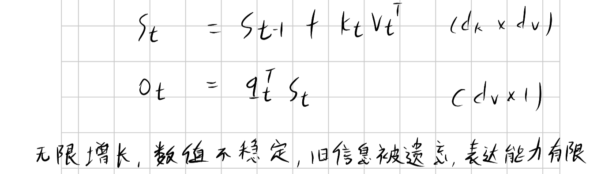

 
状态矩阵的更新只有增加，没有遗忘机制。这样到了后面的时间步，即使前期的某些信息可能十分重要，前面时间步的内容也会被覆盖遗忘，这限制了它的表达能力。此外，不同于标准注意力有softmax这一归一化操作，传统线性注意力可能面临数值爆炸问题，这给训练带来困难。

## Kimi DeltaNet Attention

### DeltaNet

对传统线性注意力的第一步改造，是让它有合适的更新与遗忘机制。

    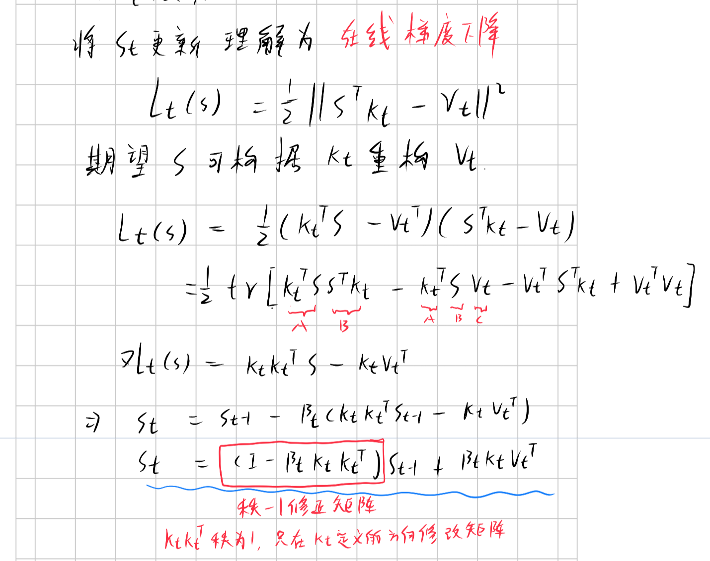

 

如图所示，每次更新会先根据当前的信息进行合适的遗忘，再写入新的信息。

### Gated

正如标准注意力可以进化为**多头注意力**，线性注意力也可以采用多头。这样既可以通过多头并行计算提高效率，还可以增强表达能力。图中的的α是每个注意力头单独的参数，用于更加精细的控制状态的遗忘。

    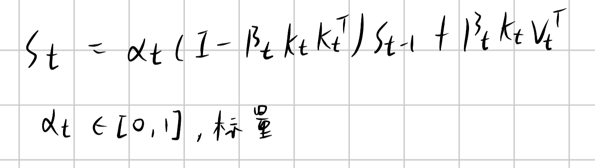

 

### KDA

相比于上面的门控线性注意力，KDA更进一步，在特征层面控制状态的遗忘。一个token的嵌入向量在映射为KQV后依旧是一维向量，也就是说这个一维向量的每一个数值，都有一个单独的α进行控制。

    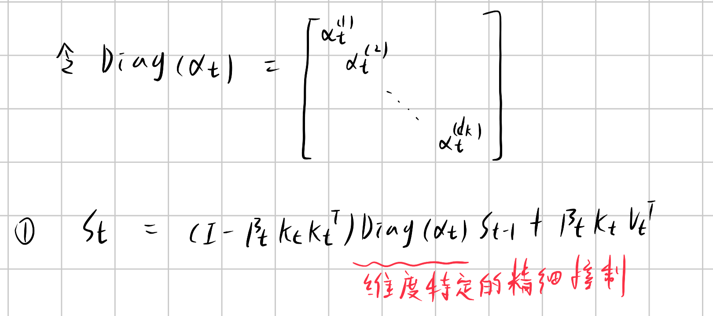

 

## WY表示

完整的状态更新公式如下。现在的问题在于这是个串行计算，没法利用GPU强大的并行计算能力。

    

 
对于上面的状态更新公式，可以使用WY表示写成紧凑的表示形式。

 

    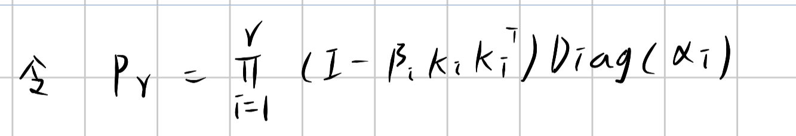

    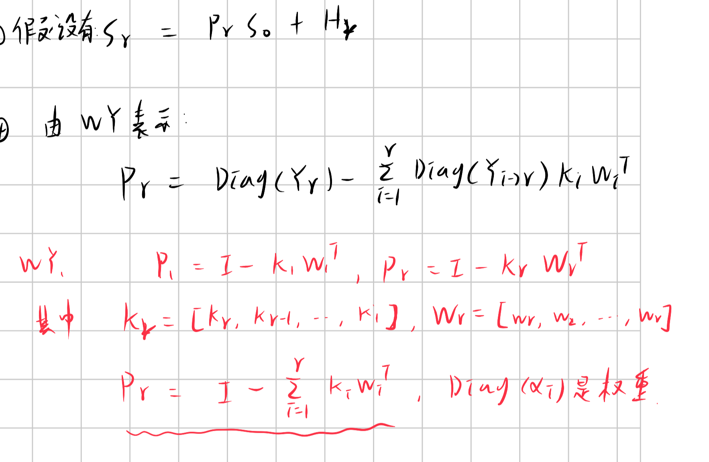

 

其中，辅助向量 w 的计算公式如下：

    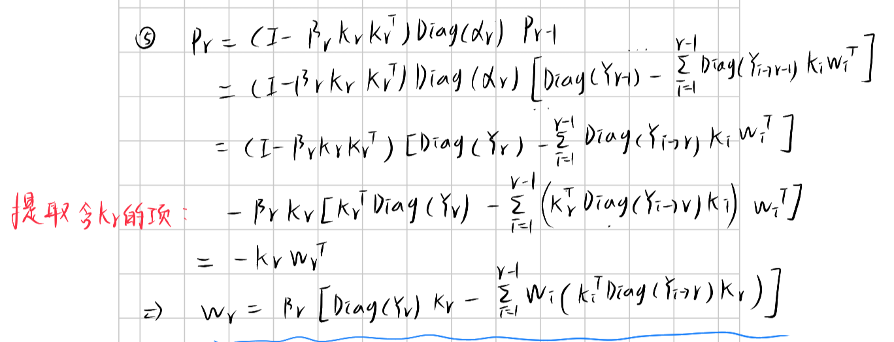

 

Hr 的计算公式如下：

    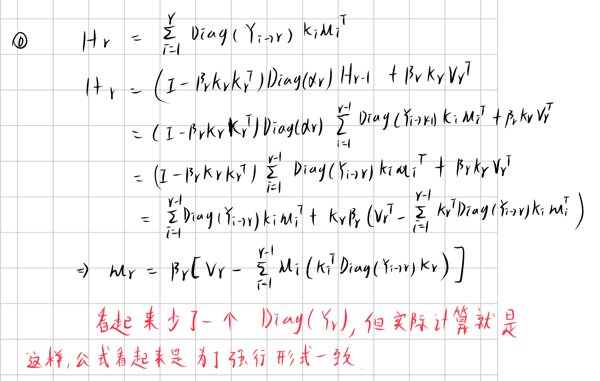

 

其中：
$$
\gamma_{i\to r} = \prod_{k=i}^{r} \ α_k \\

Diag(\gamma_{i\to r}) = \prod_{k=i}^{r} Diag(\ α_k)

$$

现在通过WY表示，我们可以把状态更新公式写成：
$$
S_r = P_r * S_0 + H_r
$$

但是 w和u 这两个辅助向量仍然是递推计算的，要想实现并行计算，我们还需要进行**UV变换**。

## UV变换

按照下图所示的方式构建矩阵A。

    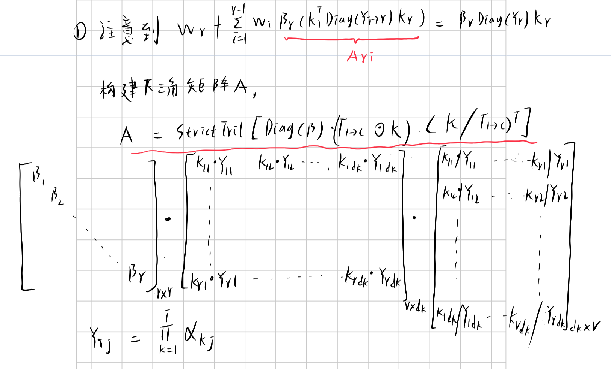

    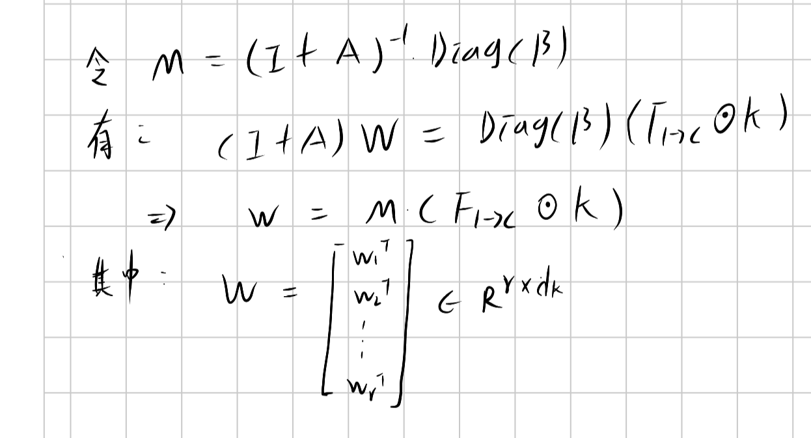

 

一旦计算出矩阵 M，我们可以并行计算出每一个w。对于u，也是同样的做法：

    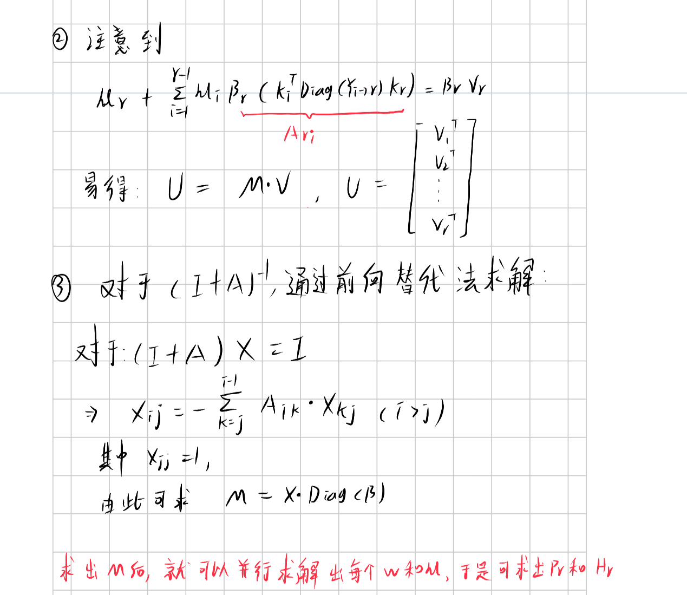

 

通过**UV变换**，只有在前向替代计算M时，才需要串行计算，辅助向量w和u都可以并行计算得到。一旦计算出w和u，我们可以计算出任意一个时间步的P和H，由此计算出任何时间步的S。

## 块间状态传递和输出

### 块间状态传递

我们知道线性注意力的一个显著优势是时间复杂度是O(T)，这意味着模型可以处理更长得多的上下文。但是，如果直接处理整个长序列，那意味着需要构建非常大的矩阵，比如说对于上下文为1M的模型，在训练时直接构建（1M，1M）的矩阵简直是个灾难——这意味着巨大的空间占用！此外，γ是通过α连乘得到，1M次的连续乘法，如何保证数值稳定性同样是个难题。

为了权衡并行计算能力和空间占用，KDA采用分块计算策略——块内并行计算，块间状态传递。

    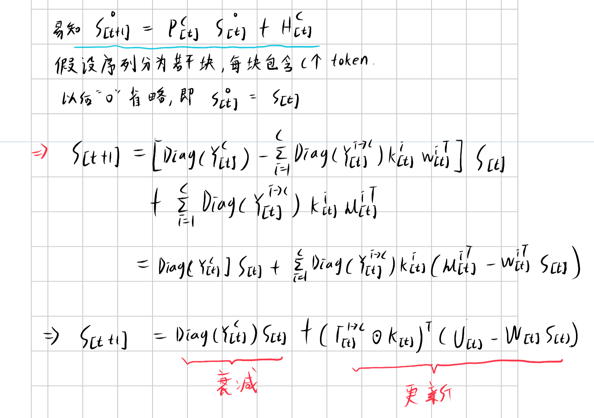

 

每个块的最后一步状态会传递给下一个块，作为初始状态，即：

$$
S_{t}^{c} = S_{t+1}^{0}
$$

### 输出

通过前面的推导，我们知道在块内可以并行计算出每个时间步的状态，然后通过下面的式子计算得到输出：

$$
o_{t}^{r} = q_{t}^{rT} \cdot S_{t}^{r}
$$

具体而言，计算方式如下图所示：

    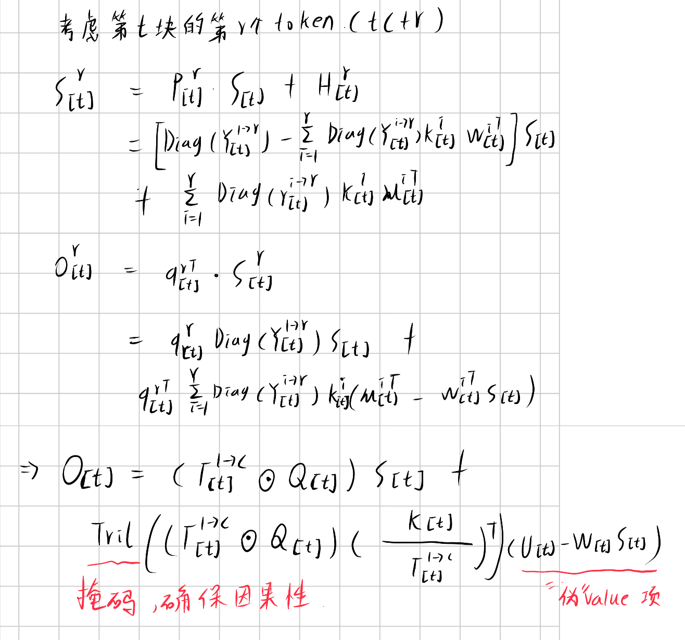

 

## 结语

KLA和标准注意力差别很大，相比起transformer，这更像RNN。

