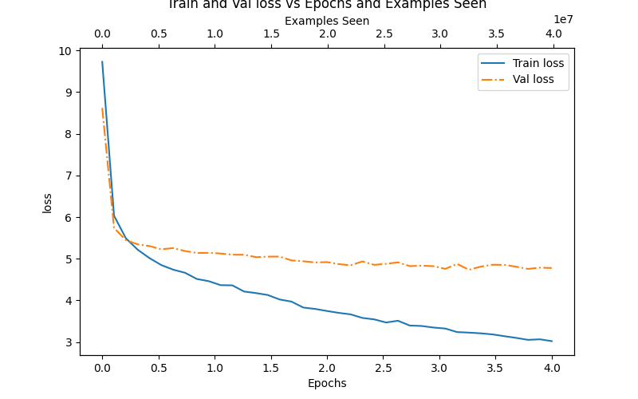
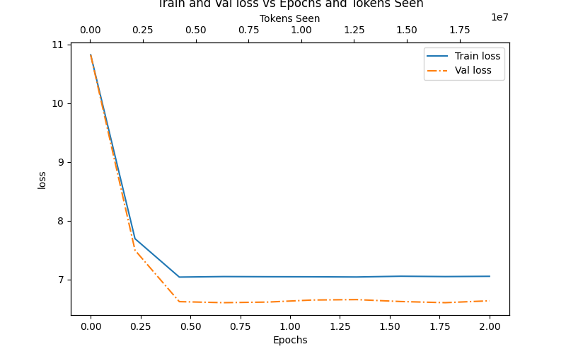
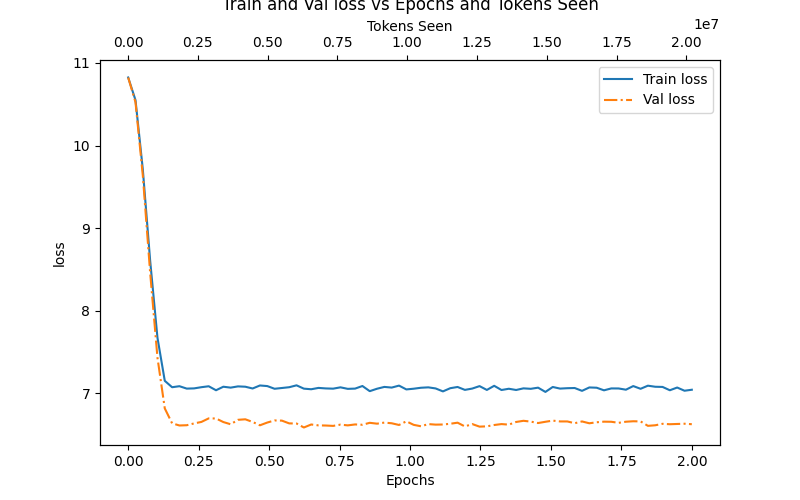
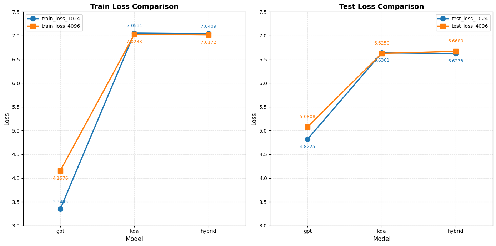

# COMPARE LABS

## 概述

《Build a LLM from the scratch》这本书在附录提供了使用6000本书对gpt2进行预训练的方法。我下载了60本书用作训练，10本书用作测试。KLA论文中提到3层线性注意力+1层标准注意力效果最好，于是我对比了混合注意力、全线性注意力和全标准注意力三种架构。

## 实验配置

使用48GB的40系列显卡，在python 3.10+torch 2.6.0+cuda 12.6.0的环境下进行实验。

由于我自己实现的chunk_kda方法在实验中遇到严重的数值问题，即使进行了梯度裁剪、进行数值裁剪也没法解决问题，于是采用kimi官方提供在fla库里的实现。

序列长度统一为1024（gpt2的默认长度），所有模型由8层注意力层组成。

## 实验结果

### loss对比

三种架构的部分实验如下图所示：

**（序列长度为1024）**

    
     GPT

 

    
     KDA

 

    
     Hybrid

 

从图中可以看出来：

- 采用标准注意力的GPT的模型容量更大，表达能力更强，训练和验证loss都低于其它两个架构。

- 两种线性注意力架构的模型容量相似，loss相近，不过混合架构更快收敛。

- GPT在训练后期出现了过拟合，但KDA和Hybrid却出现了验证loss低于训练loss的情况。

分析：

- 在标准注意力中，每个token可以直接访问它之前的每个token，而线性注意力中，只能访问累计的历史状态。GPT拥有更大的模型容量和表达能力是很容易理解的。KDA的 Delta Rule：v_t - S·k_t 本质上是一种残差更新，强制模型学习"新信息与记忆的差异"，这本身就是强大的正则化；而传统Attention直接读写，没有这种约束。这使得GPT能够进一步学习甚至记住训练数据，因此出现过拟合；KDA则被逼迫学习泛化特征，反而验证loss低于训练loss。

- Hybrid相比KDA收敛更快，因为attention层能够聚合全局信息。本来8层KDA才能捕捉的依赖关系，两层attention提供了“捷径”或者说“增强器”，但也由于只有2层attention，所有没有显著的增加模型的容量，因此保留了全线性注意力的训练特性。

### 两种序列长度下loss对比

设置序列长度为4096，KDA和Hybrid选择训练2个epoch后的loss，GPT选择训练3个epoch后的loss，对比图如下：

    
     KDA

 

在序列长度增长为原来的4倍时，KDA和Hybrid的loss保持原来的水平，但GPT无论是训练还是测试loss都有明显的上升。这表明，KDA更适合扩展到更长的上下文（不过此时GPT的效果仍然比KDA和Hybrid更好）。

当序列长度增加时，GPT中每个token需要与更长的序列交互，注意力会被分散，并且由于其O(n^2)的时间复杂度，训练也会更加困难。KDA通过恰当的状态更新机制，处理更长的序列时也能捕捉重要信息，对长度的敏感性更低。

## 结论和预期

这次实验对比了三种架构的训练结果，发现由标准注意力组成的GPT有更大的模型容量和表达能力，KDA和Hybrid收敛更快且泛化能力更强，并且更适合扩展至更长得上下文。

在目前的实验中，KDA展现了良好的的扩展性和泛化性，但在绝对性能上依旧落后于GPT。不过如果在更长得多的上下文时，比如64k、128k时，KDA可以凭借扩展性在绝对性能上超过GPT吗？这些有待未来探究。